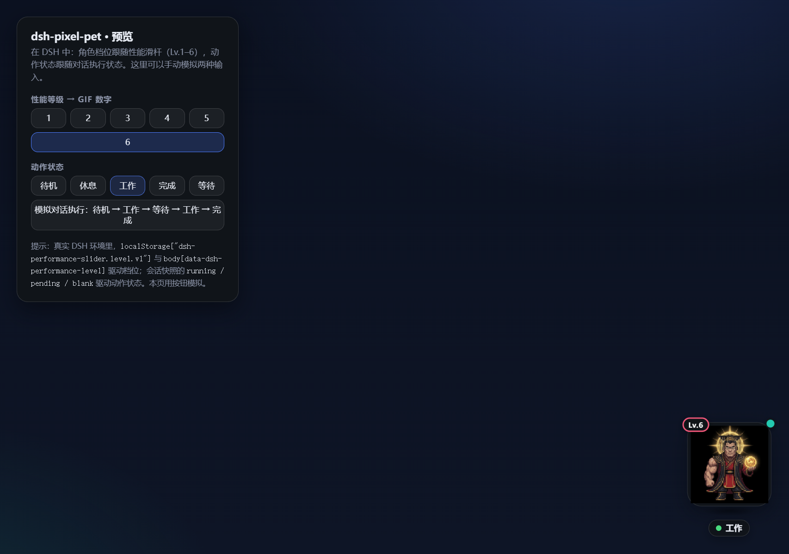
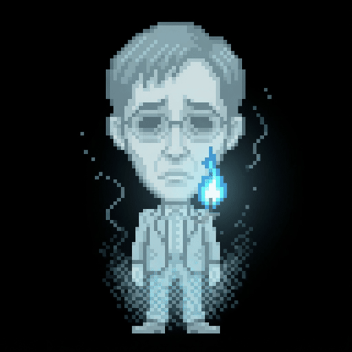
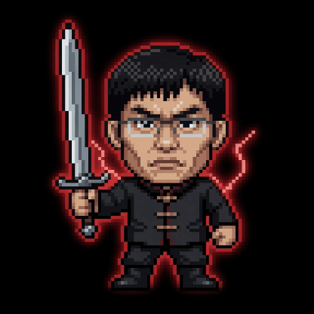

# dsh-pixel-liangzu

一个 DeepSeek Harness（`dsh web` / `dsh-desktop`）的**像素大头桌面宠物**插件。

> 曾用名 `dsh-pixel-pet`。为避免 dsh.so 上与其他同名仓库撞 slug，已更名为 `dsh-pixel-liangzu`。安装请用新包名。



| Lv.1 | Lv.2 | Lv.3 | Lv.4 | Lv.5 | Lv.6 |
|------|------|------|------|------|------|
|  |  |  |  |  |  |

宠物本体是 `gifs/` 里的 30 张 2 帧循环像素大头 GIF（6 档角色 × 5 种动作状态），
由插件 host 侧从 `/plugins/dsh-pixel-liangzu/gifs/…` 提供，悬浮在 Harness 界面右下角。

## 两条对齐规则

### 1. GIF 数字 ↔ 性能等级（`dsh-performance-slider`）

宠物读取性能滑杆的当前档位，角色随档位切换：

| 档位 | GIF | 角色 | 滑杆档位 |
|------|-----|------|----------|
| Lv.1 | `01_*.gif` | 瘦白领 | Flash · off |
| Lv.2 | `02_*.gif` | 清秀西装 | Flash · low |
| Lv.3 | `03_*.gif` | 型男西装 | Flash · max |
| Lv.4 | `04_*.gif` | 中山装 | Pro · off |
| Lv.5 | `05_*.gif` | 怒目武者 | Pro · high |
| Lv.6 | `06_*.gif` | 冕冠帝王 | Pro · max |

档位来源（与 `dsh-performance-slider` 完全共享，无需额外安装它也能工作）：

1. `localStorage["dsh-performance-slider.level.v1"]`（0–5）
2. cookie `dshps_level`（端口无关，重启后仍能恢复）
3. `body[data-dsh-performance-level]`（滑杆每次应用档位/拖拽都会写，宠物用
   MutationObserver 实时跟随，连拖动过程中的变化都能感知）

### 2. 动作状态 ↔ 对话执行状态

宠物订阅当前会话（`sessions.currentProvideInfo` + `session.getSnapshot()`）的
`ConversationSnapshot`，按下面的优先级推导动作：

| 宠物状态 | GIF | 会话快照条件 |
|----------|-----|--------------|
| 工作 `work` | `*_work.gif` | `running === true` 且无待处理交互 |
| 等待 `wait` | `*_wait.gif` | `running`（或暂停）且 `pending` 非空（在等审批/提问） |
| 完成 `done` | `*_done.gif` | `running` 由 true 翻转为 false（展示约 3.6 秒后回到待机） |
| 休息 `rest` | `*_rest.gif` | 无会话 / 会话为 blank（还没有消息） |
| 待机 `idle` | `*_idle.gif` | 其余情况 |

宠物同时显示：`Lv.N` 等级徽章（颜色随档位）、状态胶囊（待机/休息/工作/完成/等待）、
状态切换时的气泡（干活中… / 等你呢… / 搞定！）、最近错误红边提示。
点击宠物可查看详情弹层（等级、角色、档位、状态、会话、执行中、等待交互、最近错误）。

**拖动**：按住宠物（卡片区域）即可把它拖到屏幕任意位置，松手后位置写入
`localStorage["dsh-pixel-liangzu.position.v1"]`，下次打开自动恢复；窗口缩放时会
自动夹回可视区域内。拖动与点击（查看详情）自动区分，不会误触。

## 目录结构

```
dsh-pixel-liangzu/
├── lib/
│   ├── index.js          # DSH host 侧插件入口，托管 /plugins/dsh-pixel-liangzu/gifs 图片
│   └── client.pet.js     # DSH browser 侧插件：悬浮宠物 + 等级/状态对齐
├── assets/
│   ├── screenshot.png    # README 预览截图
│   └── gifs/             # 30 张 {01-06}_{idle,rest,work,done,wait}.gif（来自 pixel_bighead）
├── scripts/
│   ├── install.mjs       # 一键安装到 ~/.dsh/profiles/web
│   └── check.mjs         # 静态检查 DSH client-plugin 包契约
├── demo/
│   └── index.html        # 不依赖 DSH 的独立预览页
├── cordis.patch.yml      # dsh.bundle 层：安装后自动 insert 插件行
├── package.json
└── README.md
```

## 安装到 dsh web profile

需要 `pnpm`。本包声明了 `dsh.bundle`，`dsh plugin add` 会自动挂上 `cordis.patch.yml`。

```sh
# 推荐：从 GitHub 安装（dsh.so / registry 同款）
dsh plugin --profile web add github:mobius/dsh-pixel-liangzu

# 本地克隆后安装
git clone https://github.com/mobius/dsh-pixel-liangzu.git
cd dsh-pixel-liangzu
node scripts/install.mjs
# 或
dsh plugin --profile web add "file:$(pwd)"
```

然后重启 `dsh web`（dsh-desktop：**Server → Restart dsh web**）。

安装完成后，宠物会出现在 Harness 界面右下角：拖动性能滑杆换角色，
向 AI 发消息 / 等待审批 / 任务完成时，它会跟着换动作。

## 卸载

```sh
cd ~/.dsh/profiles/web
pnpm remove dsh-pixel-liangzu
```

并从 `~/.dsh/profiles/web/cordis.patch.yml` 中删除
`- insert: ... name: dsh-pixel-liangzu ...` 整段。

## 快速预览

不用安装到 DSH，直接用浏览器打开 `demo/index.html` 即可：面板上可以手动切换
等级（Lv.1–6）与动作状态（待机/休息/工作/完成/等待），也可以一键播放
「待机 → 工作 → 等待 → 工作 → 完成」的模拟对话流程。先跑一下包契约检查：

```sh
node scripts/check.mjs
```

## 自定义

- 想换 GIF：直接替换 `assets/gifs/` 下的同名文件（保持
  `{01-06}_{idle,rest,work,done,wait}.gif` 命名），重启后生效。
- 想改状态映射/文案：编辑 `lib/client.pet.js` 中的 `derive` 逻辑与 `zh/en`
  字典。
- 想换悬浮位置：改 `lib/client.pet.js` 里 `.dshpet` 的 `right/bottom`。

## 提交到 dsh.so

仓库已声明 `dsh.bundle` + `dsh.client`，许可证 MIT。在 https://www.dsh.so/submit/ 粘贴：

```
https://github.com/mobius/dsh-pixel-liangzu
```
